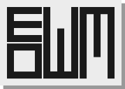

> There will be further development and support.




`┏┓┏┓┓┏┏┏┳┓`  
`┗ ┗┛┗┻┛┛┗┗`
============

This is a simple window manager that continues and develops the idea of catwm for learning purposes.

Keybinds
-------

Mod - Mod1Mask (Alt)
You can replace it with Mod4Mask (Win)

|      Keybind      | Action |
|-------------------|--------|
| Mod + j/k         | next/prev window |
| Mod + f           | fullscreen |
| Mod + q           | kill window |
| Mod + c           | quit |
| Mod + Shift + j/k | move down/up focused window in stack |
| Mod + h/l         | inc/dec master |
| Mod + Space       | toggle master with top stack |
| Mod + Return      | spawn alacritty |
| Mod + p           | spawn dmenu\_run |
| Mod + 1-9         | Switch workspaces |
| Mod + Shift + 1-9 | Switch window between workspaces |
| Mouse hover       | focus |


Layout
------

```
 ____ ______________
|    |              |
|____|              |
|    |    Master    |
|____|              |
|    |              |
|____|______________|
```

borders and padding, but still no UI  
new window pushes master to the top of the stack


Screenshots
-----------


Name
----

Naming it was vewy hard:
 * catwm - origin
 * kittywm - stupid
 * meowm - two m's
 * eowm - hmm, sounds good


Why?!
-----

cuz rewriting from scratch was easier than waiting for the PR, even tho i suck at programming


Thanks to:
==========

 * [catwm](https://github.com/pyknite/catwm) - inspiration
 * [tinywm](https://github.com/mackstann/tinywm) - basic knowledge
 * [dwm](https://git.suckless.org/dwm) - everything
 * [sowm](https://github.com/dylanaraps/sowm) - base for [mewm](https://codeberg.org/qwaderton/mewm)
